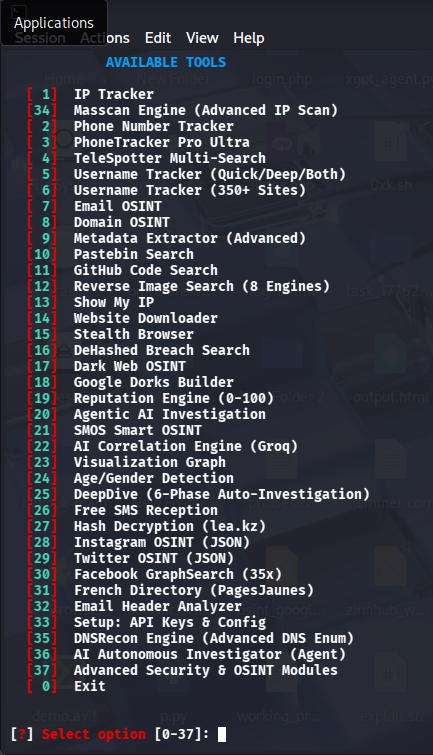
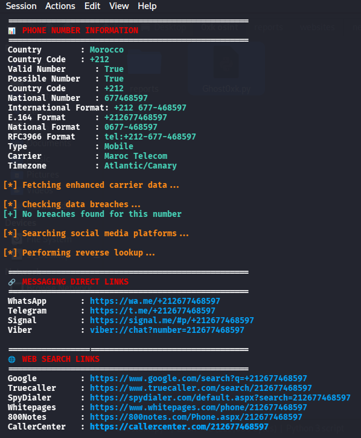

<div align="center">
  <br>
  <pre>
                  .·´¯¯¯¯`·.
                :'                 ':
               :             . ·´¯¯¯¯`·.
 .·´¯¯`·.,.:´      .  ·  ´              /
 \            . ·´¯     ¯¯¯¯ ¯¯  `  · .
   `·.__.·´¯|/                  .·´¯`·.    |
              |/    .´¯`·.      /       /     |
               |   /       \   /              |
         :´¯`· . \   ..-–=\|/  ()   /     / .·´¯`:
         :,  \      :´¯¯`·      ·´¯¯`:         /  ,:
      :´''            :                 :               '''`:
     ;   ¸¸¸¸¸....––'·.,         , .·'··––....¸¸¸.,;:::;:::::::::\·´¯`/
       :,  ¯¯   ¯         ¯¯¯¯            ¯ ¯¯¯  ,:
        :.                                              .:
          ` · .,, __,,, ..  ·´` ·  .. , ,, __ ,, . ·´
                          GHOST0XK ™
                                          ßÿ, 0xk
  </pre>
  <br>

  # 👻 Ghost0xK - OSINT Framework

**An advanced all-in-one Open Source Intelligence (OSINT) investigation toolkit**

[](https://python.org)
[](LICENSE)
[](https://github.com/0xk212/ghost0xk)

<br>

<div align="center">
  
</div>

<br>
</div>

---

## 📋 Table of Contents

- [Overview](#-overview)
- [Features](#-features)
- [Installation](#-installation)
- [Usage](#-usage)
- [Modules in Detail](#-modules-in-detail)
- [Requirements](#-requirements)
- [Output Formats](#-output-formats)
- [Disclaimer](#-disclaimer)

---

## 🔍 Overview

**Ghost0xK** is a comprehensive OSINT investigation framework designed for cybersecurity professionals, penetration testers, and digital investigators. It provides **18 integrated investigative modules** covering IP analysis, phone tracking, username reconnaissance, email intelligence, domain profiling, dark web monitoring, and more — all from a single unified command-line interface.

---

## ✨ Features

| # | Module | Description |
|---|--------|-------------|
| 1 | **🌍 IP Tracker** | Geolocation, threat scoring, port scanning, DNSBL, traceroute, weather, nearby networks, WHOIS, risk analysis |
| 2 | **📱 Phone Tracker** | Carrier lookup, geolocation, line type detection, breach checking, social media search, reverse lookup, messaging links |
| 3 | **👤 Username Tracker** | Scans **50+ social platforms** with confidence scoring (0-100) per platform |
| 4 | **📧 Email OSINT** | Breach detection (HaveIBeenPwned), SMTP verification, Gravatar, GitHub code references, EmailRep reputation |
| 5 | **🌐 Domain OSINT** | DNS, SSL, WHOIS, subdomain discovery (CRT.sh), technology detection, security analysis (HSTS/SPF/DMARC), Wayback Machine |
| 6 | **📄 Metadata Extractor** | EXIF from images (GPS, camera model), PDF metadata, Office document metadata (docx/xlsx/pptx) |
| 7 | **📝 Pastebin Search** | Search psbdmp.ws, Google-indexed pastes, GitHub gists |
| 8 | **💻 GitHub Code Search** | Search users, repositories, code snippets; extract emails and profile data |
| 9 | **🖼️ Reverse Image Search** | Google Lens, Bing, Yandex, TinEye, SauceNao |
| 10 | **🖥️ Show My IP** | Display your public IP with geolocation |
| 11 | **📦 Website Downloader** | Full site download with form submission, cookie persistence, JS/CSS assets |
| 12 | **🕵️ Stealth Browser** | Anti-detection browser using Playwright with fingerprint spoofing |
| 13 | **🔐 DeHashed Search** | Breach database search (email, username, phone, IP, domain) |
| 14 | **🌑 Dark Web OSINT** | Ahmia search via Tor, onion link availability testing |
| 15 | **🔍 Google Dorks Builder** | 40+ pre-built dork queries across 6 categories with built-in execution |
| 16 | **🤖 Agentic AI** | Autonomous multi-step recursive investigation (email → username → domain → platforms) |
| 17 | **📊 Visualization Graph** | Interactive NetworkX/PyVis graph of investigation relationships |
| 18 | **🧑 Age/Gender Detection** | Face analysis via DeepFace or OpenCV; avatar scanning from GitHub/GitLab |

---

## ⚙️ Installation

```bash
# Clone the repository
git clone https://github.com/0xk212/ghost0xk.git
cd ghost0xk

# Install core dependencies
pip install requests beautifulsoup4 phonenumbers Pillow dnspython

# Optional modules
pip install opencv-python deepface                # Age/Gender Detection
pip install playwright && playwright install      # Stealth Browser
pip install networkx pyvis                        # Visualization Graph
pip install python-whois                          # WHOIS lookups

# Tor (for Dark Web module)
# Download & install Tor Browser from https://www.torproject.org/
```

> **Note:** Python 3.8+ is required.

---

## 🚀 Usage

```bash
python Ghost0xk.py
```

Navigate the menu by entering the corresponding number:

```
╔════════════════════════════════════════╗
║            AVAILABLE TOOLS             ║
╠════════════════════════════════════════╣
║  [ 1]  IP Tracker                      ║
║  [ 2]  Phone Number Tracker            ║
║  [ 3]  Username Tracker                ║
║  [ 4]  Email OSINT                     ║
║  [ 5]  Domain OSINT                    ║
║  [ 6]  Metadata Extractor              ║
║  ...                                   ║
║  [ 0]  Exit                            ║
╚════════════════════════════════════════╝
```

All reports are automatically saved in the `reports/` directory in JSON and TXT formats.

---

## 📸 Screenshots

<div align="center">
  
</div>

---

## 🧩 Modules in Detail

### 🌍 IP Tracker
- **Sources:** ipwho.is, ip-api.com, ipinfo.io, AbuseIPDB, BGPView
- **Features:**
  - Geolocation (country, city, region, ZIP, coordinates)
  - Proxy/VPN/TOR/hosting detection
  - Threat score & abuse reputation
  - DNSBL blacklist check (Spamhaus, Barracuda, SpamCop, SORBS)
  - Port scanning (20+ common ports)
  - Traceroute with geographic hops
  - Weather at location (wttr.in, Open-Meteo)
  - Nearby networks (same ASN)
  - WHITESPACE WHOIS registration data
  - Risk score calculation (0-100)
  - Google/Bing/Yandex/Here maps links

### 📱 Phone Tracker
- **Library:** phonenumbers (Google's libphonenumber port)
- **Features:**
  - Country detection from 200+ country codes
  - Carrier detection
  - Line type (Mobile, VoIP, Toll-Free, etc.)
  - Multiple formatting (E.164, International, National, RFC3966)
  - Validity scoring (High/Medium/Low)
  - Data breach checking (Leak-Lookup, HaveIBeenSold)
  - Social media search links (WhatsApp, Telegram, Signal, Viber, Truecaller, etc.)
  - Reverse lookup (name, address, email)
  - Complaint site aggregation

### 👤 Username Tracker
- **Platforms:** 50+ (Facebook, X/Twitter, Instagram, LinkedIn, GitHub, Reddit, Telegram, TikTok, Snapchat, YouTube, Spotify, Patreon, Steam, Discord, and more)
- **Confidence Scoring:**
  - HTTP status code analysis
  - Not-found pattern detection
  - Profile indicator analysis (avatar, bio, followers, joined date, etc.)
  - Open Graph / Twitter Card detection
  - Content richness analysis
- **Additional:** Possible email generation, breach checking, similar username suggestions

### 📧 Email OSINT
- Breach detection via HaveIBeenPwned API
- SMTP mailbox verification (check if email actually exists on the server)
- Gravatar profile extraction (name, location, bio)
- EmailRep.io reputation scoring
- Firefox Monitor breach stats
- GitHub commit/code search by email
- Social media platform search links
- Hash generation (MD5, SHA1)

### 🌐 Domain OSINT
- DNS records (A, AAAA, NS, MX, TXT, SOA)
- SSL certificate analysis (issuer, subject, expiry, SAN)
- HTTP header analysis & technology detection
- CRT.sh certificate transparency (subdomain discovery)
- Security analysis (HSTS, SPF, DMARC)
- WHOIS registration data
- Wayback Machine archival history
- Similar domain / typosquatting detection
- Technology fingerprinting (React, Vue, Angular, WordPress, etc.)

### 📄 Metadata Extractor
- **Images (JPEG, PNG, TIFF, WebP, BMP):** Camera model, GPS coordinates, software, date
- **PDF:** Author, title, producer
- **Office Documents (docx, xlsx, pptx):** Creator, last modified by, company, application
- GPS coordinates with Google Maps & OpenStreetMap links

### 🔍 Google Dorks Builder
- 40+ pre-built dork queries across 6 categories:
  1. Files & Documents (pdf, xlsx, docx, env, sql, log, config, backup)
  2. Login Portals & Admin (admin, wp-admin, cpanel, webmail)
  3. Cameras & IoT (webcam, DVR, router, printer)
  4. Exposed Services (git, AWS, Jenkins, Kibana, Grafana)
  5. Personal Information (email lists, passwords, ID cards, resumes)
  6. Social Media OSINT (LinkedIn, Facebook, Twitter, Instagram)

### 🤖 Agentic AI Investigation
- Autonomous recursive investigation starting from a single input
- Automatically discovers related entities (email → username → social platforms → domain → IP)
- Breadth-first exploration with configurable depth & branching
- Generates interactive HTML relationship graph

### 🕵️ Stealth Browser
- Playwright-based browser with anti-fingerprinting
- Spoofs: WebDriver, Canvas, WebGL, Fonts, Timezone, Languages
- Random viewport, user-agent rotation
- Cookie capture
- Full-page screenshot capability

### 🌑 Dark Web OSINT
- Ahmia.fi search engine querying via Tor
- Automatic onion link discovery
- Reachability testing with title extraction
- Requires Tor service running locally

---

## 📦 Requirements

### Core (mandatory)
| Package | Version | Purpose |
|---------|---------|---------|
| Python | 3.8+ | Runtime |
| requests | Latest | HTTP requests |
| beautifulsoup4 | Latest | HTML parsing |
| phonenumbers | Latest | Phone number validation |
| Pillow | Latest | Image metadata extraction |

### Optional (feature-specific)
| Package | Module | Purpose |
|---------|--------|---------|
| opencv-python | Age/Gender | Face detection & analysis |
| deepface | Age/Gender | Deep learning face analysis |
| playwright | Stealth Browser | Headless browser automation |
| dnspython | Email/Domain | DNS MX record resolution |
| networkx | Visualization | Graph data structures |
| pyvis | Visualization | Interactive HTML graphs |
| python-whois | Domain | WHOIS lookups |
| Tor service | Dark Web | .onion routing |

---

## 📄 Output Formats

All scan results are automatically saved to the `reports/` directory:

| Format | Description |
|--------|-------------|
| **JSON** | Machine-readable structured data |
| **TXT** | Human-readable formatted report |
| **CSV** | Tabular data (username scans only) |
| **HTML** | Interactive investigation graphs |

Example report filename: `ip_8.8.8.8_2026-06-12_14-30-00.json`

---

## ⚠️ Disclaimer

This tool is intended **for authorized security testing and educational purposes only**. Users are solely responsible for complying with all applicable local, state, and federal laws. The developers assume no liability and are not responsible for any misuse or damage caused by this program.

**Do not use this tool against targets without proper legal authorization.**

---

<div align="center">
  <br>
  <p>
    <strong>Ghost0xK</strong> — Crafted with ❤️ by <strong>0xk</strong>
    <br>
    <sub>YouTube: <a href="https://www.youtube.com/@0xk-j7z">@0xk-j7z</a></sub>
  </p>
  <br>
</div>
